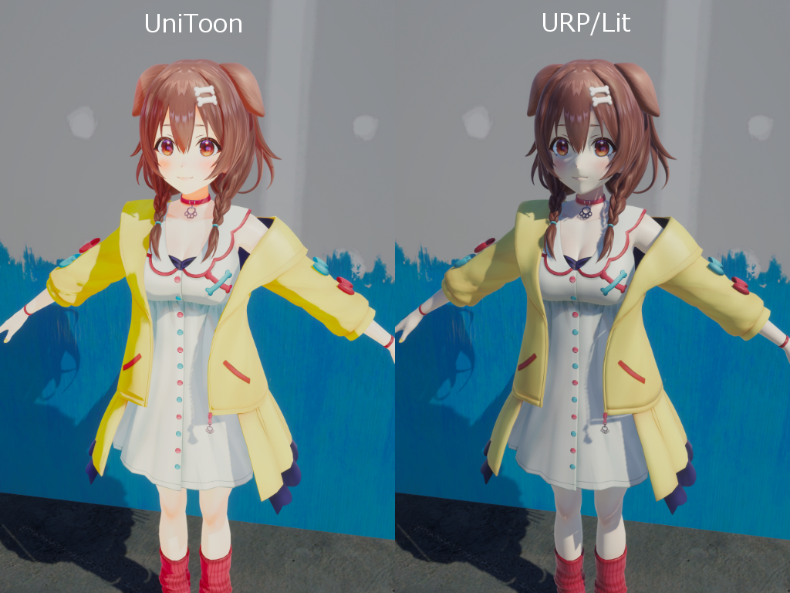
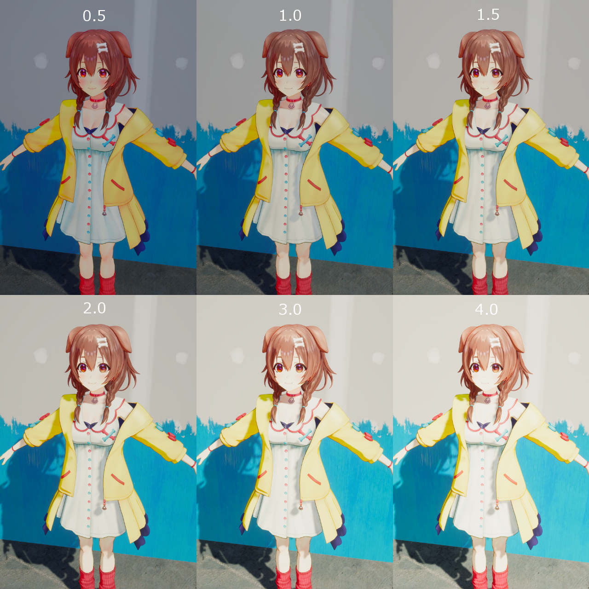
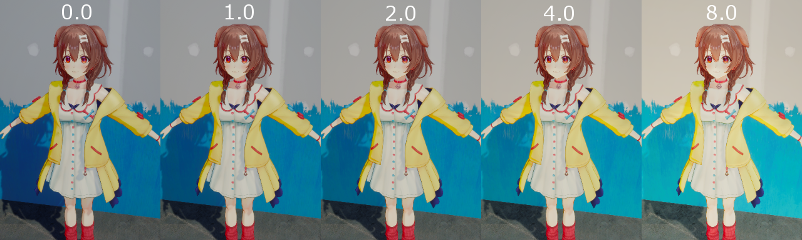
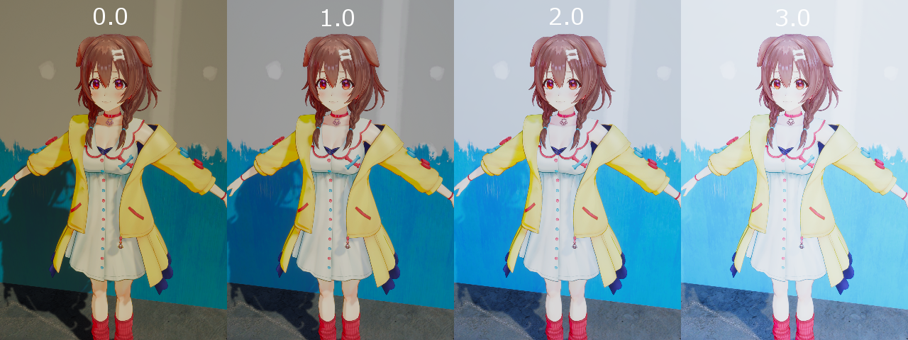
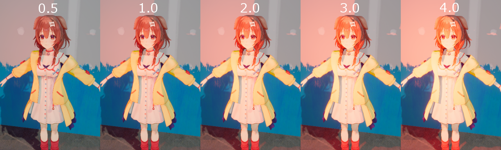
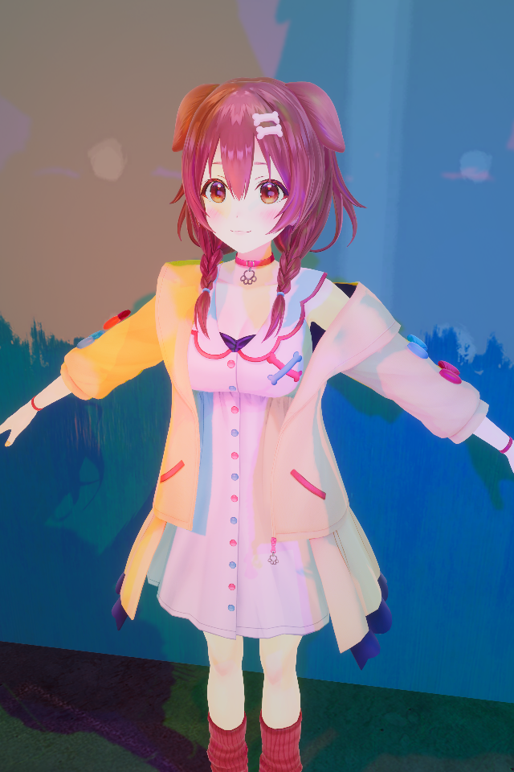

# UniToon

ver 0.16.0-alpha

Physically-based Toon Shader for game applications. Compliant with Unity standard rendering functions. It is not targeted to be multifunctional in order to keep performance, but to be universally usable.

## Features
* Both Toon and PBR expressions
* Blends in with the environment
* No custom shader keywords
* No goal of multifunctionality

## Compatible

UniToon supports any light environment implemented by Unity.
* Light(Directional, Point, Spot, Area)
* Light Intensity, Indirect Multipiler
* Baked Global Illmination
* Realtime Global Illmination
* Environment Lighting (Skybox, Gradient, Color)
* Reflection Probes

The following shader passes are also supported for situations where these are required
* ShadowCaster
* DepthOnly
* DepthNormals
* Meta

## Install

* Unity Package Manager (UPM)

You can import packages from the path below

`https://github.com/yoship1639/UniToon.git`

## Support Status

Render Pipeline

|  Builtin  |  URP      | HDRP      |
| --------- | --------  | --------  |
|  Not yet  |  Support  | Not yet   |

Unity Version

|  Version      | Support           |
| ------------- | ------------      |
|  Unity2019.x  | Not yet           |
|  Unity2020.1  | Not yet           |
|  Unity2020.2  | Yes               |
|  Unity2020.3  | Yes               |
|  Unity2021.1  | Yes               |
|  Unity2021.2  | Yes               |

## Gallery

Light intensity

Light indirect multipiler

Sky light intensity

Red point light

Red, Green and Blue lights

